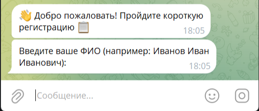
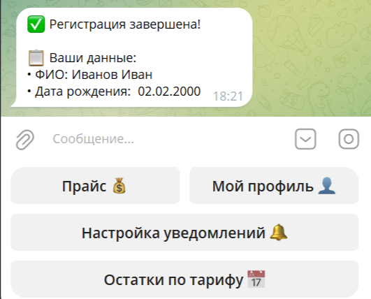
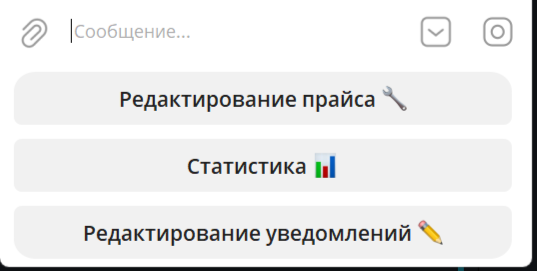
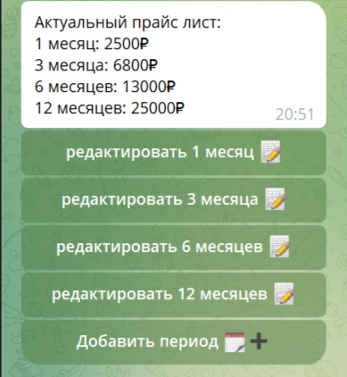
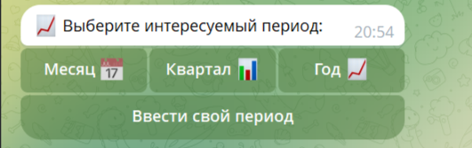
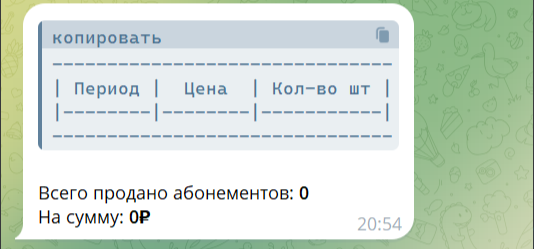

# 💪 Telegram-бот для фитнес-зала

Телеграм-бот, созданный для автоматизации взаимодействия с клиентами фитнес-зала и аналитики для администраторов. Бот разделён на две независимые части: **пользовательскую** и **административную**, каждая со своим функционалом и безопасностью.

---

## 📌 Основные возможности

- Регистрация и личный кабинет клиента  
- Просмотр прайс-листа и остатка по тарифу  
- Настройка уведомлений об окончании абонемента  
- Административные отчёты за произвольные периоды(день, месяц, квартал, год) в текстовом формате или excel формате  
- Гибкое управление периодами отчётности (ручное и автоматическое) 
- Мгновенная реакция на изменения данных благодаря **Change Streams**  
- Модульная архитектура с изолированными базами данных  

---

## 👥 Пользовательская часть

### Что доступно клиенту:

- **💰 Прайс** – актуальные цены на все виды абонементов.
- **💵 Покупка абонементов** – проработано меню покупки на перспективу интеграции платежных систем
- **📅 Остаток по тарифу** – сколько дней осталось до конца оплаченного периода.
- **🔔 Настройка уведомлений** – включение/отключение напоминаний об окончании тарифа.
- **👤 Мой профиль** – просмотр и редактирование личных данных (ФИО, дата рождения).

> При первом запуске бот вежливо предложит пройти короткую регистрацию, запросив ФИО и дату рождения. Для постоянных клиентов — персонализированное приветствие.

**Примеры взаимодействия:**

  
*Приветствие и форма регистрации нового пользователя.*

  
*Кнопки основного меню*

---

## 🔧 Административная часть

Администратор получает инструменты для получения сводок и отчётов.

### Функции администратора:
- **💳 Редактирование прайс-листа**  
    Добавление новых тарифов, изменение цен, удаление устаревших позиций. Интерфейс с пошаговыми формами и подтверждением изменений.
- **📅 Период отчета**  
    Отчёт можно запросить по месяцу, кварталу, году или задать произвольный диапазон дат (`ДД.ММ.ГГГГ - ДД.ММ.ГГГГ`).
- **📋 Тип отчёта**  
    Полный отчет с детальной статистикой (файл Excel) или сокращенный с ключевыми показателями (в формате сообщения телеграмм).
- **➕ Редактирование периодов уведомлений пользователя**  
    - Автоматическое добавление стандартных периодов.  
    - Ручное добавление выбранных периодов (например, "1 7").

**Примеры интерфейса администратора:**

  
*Основное меню администратора.*

  
*Форма редактирования тарифа: название, цена*

  
*Ввод произвольного диапазона дат.*

  
*Пример сокращенного отчёта за выбранный период.*

---

## ⚙️ Техническая реализация

### 🗄️ База данных MongoDB
Динамическая схема документов MongoDB позволит  безболезненно на лету менять структуру базы данных, добавляя новые поля и редактируя старые в условиях быстро развивающегося бизнеса

### 🧱 Модульная архитектура с изолированными данными

Бот построен по принципу **модульности**, где каждый функциональный блок работает со своей собственной базой данных:

- `tg_bot` – профили клиентов, регистрация взаимодействие с сервисами фитнес зала.
- `tracking_payment_ends` – отслеживание остатков до конца оплаченного периода.
- `payment_alerts` – отправка уведомлений об оплатах.

Такая изоляция:
- Повышает безопасность (выход из строя одного модуля не затрагивает остальные).
- Упрощает масштабирование и обслуживание.
- Позволяет независимо менять схему в каждом модуле без остановки бота.

---

## 🚀 Инструкция запуска

*Этот раздел находится в разработке. Полная инструкция по деплою появится в ближайшее время.*

